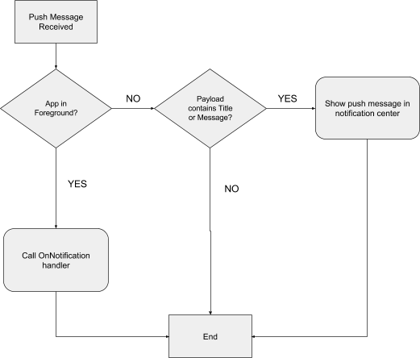
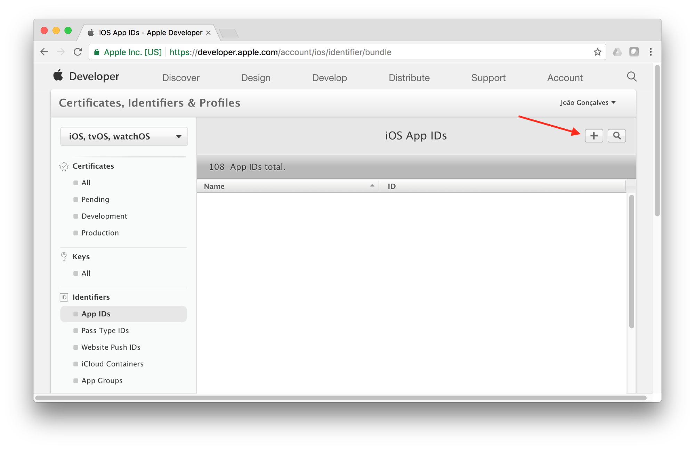
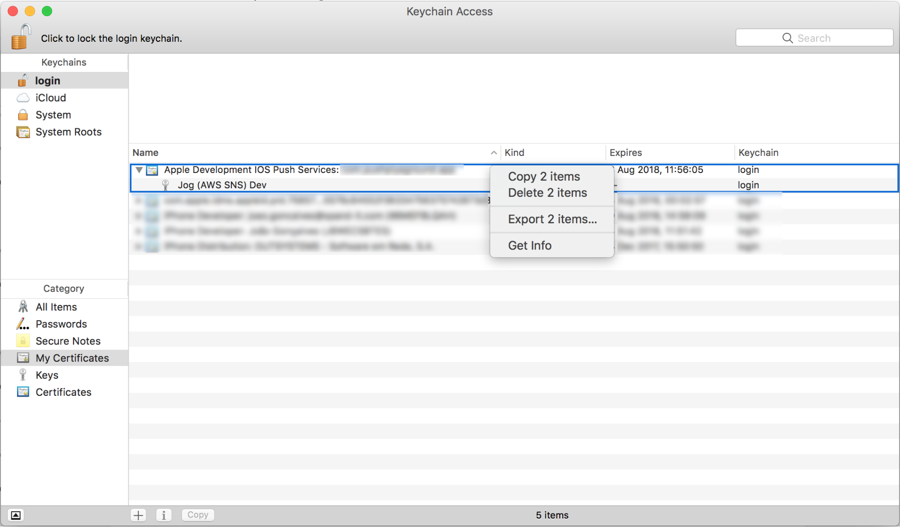
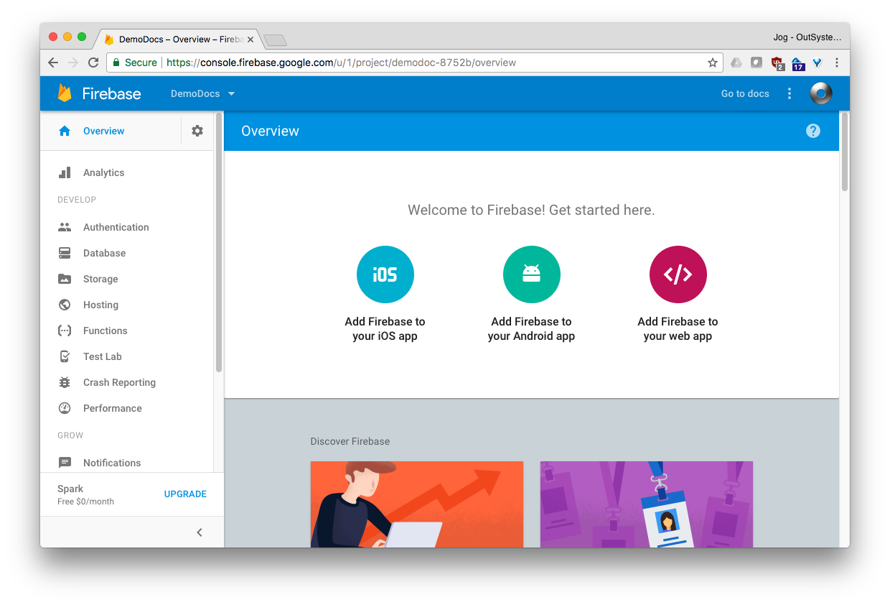
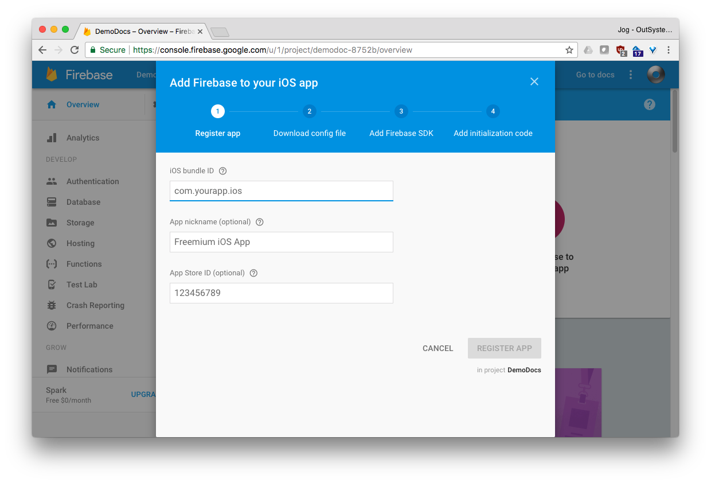
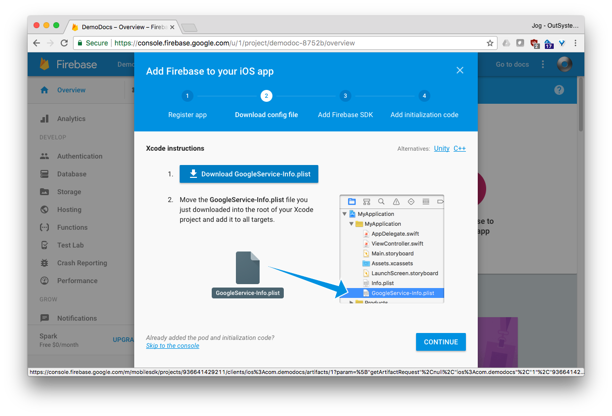
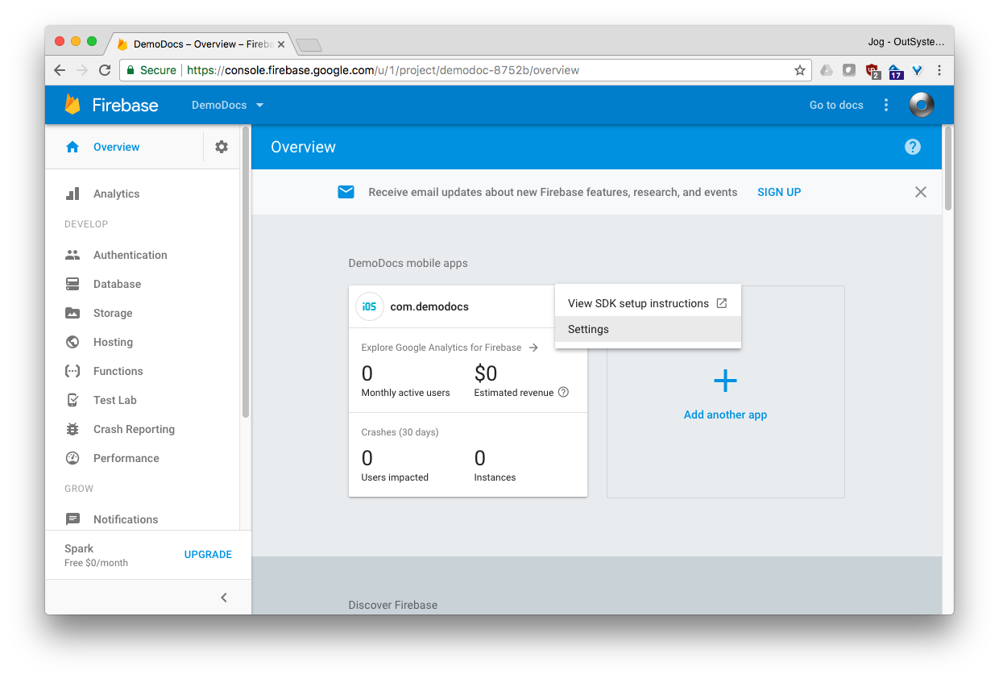
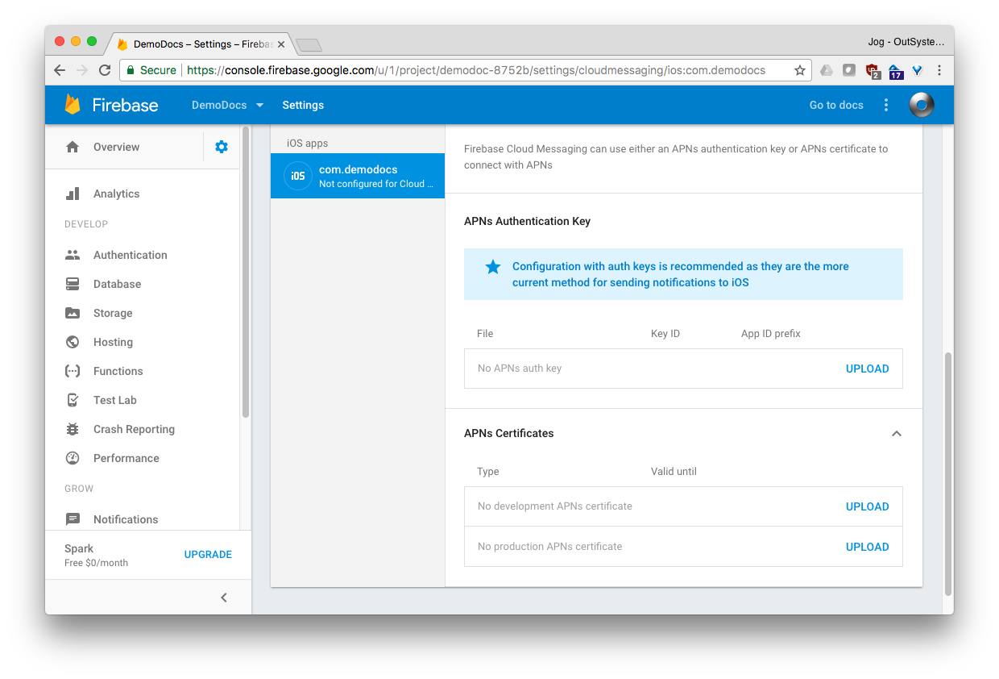
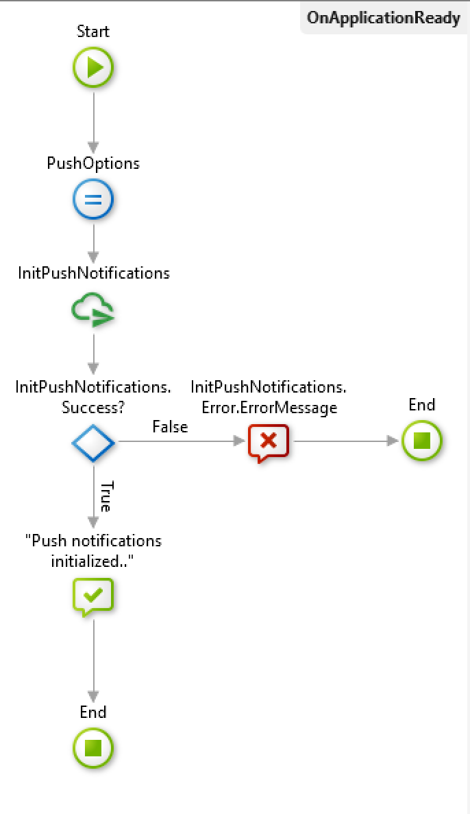

# OutSystems Mobile Plugin
The mobile plugin is largely built on top of the open source [phonegap-plugin-push plugin](https://www.google.com/url?q=https://github.com/Chuckytuh/phonegap-plugin-push/&sa=D&ust=1509368386691000&usg=AFQjCNGZ0-jauolhcodBq94sXkTsBPN79w). This plugin enables your mobile application to receive push notifications that are visible on the operating system notification center and also receive the notification data inside your OutSystems Mobile app.

#### Application Behaviour - Receiving a Push Message
The following flowchart explains how the application behaves when a push notification is received, depending on the application state.

#### Push message arrives with app in foreground
The plugin receives the data from FCM service and triggers the OnNotification event on the instance of FCMCentralDispatcher WebBlock if the plugin has been successfully initialized. Additionally, no notification is shown on the notification center of the operating system since it isn’t the expected behaviour on both Android and iOS.
 
 
#### Push message arrives with app in background
The plugin receives the data from FCM service and checks for the existence of a title or message in the received message payload. If it exists, the message is displayed on the notification center of the OS. 

## Configurations
In order to enable push notifications on an OutSystems mobile application, some requirements must be met, specifically:
* Firebase account
* And for iOS you need:
  * A valid Apple developer account
  * Access to osx to create certificates
# iOS
When targeting the iOS platform, in order to enable push notifications the mobile application has to be signed with push notification capabilities.

Access the Apple Developer Console and create a new App Id. Make sure to check “Push Notifications” under App Services.

Edit the created App Id and, under Push Notifications, create a new Push Notification certificate and save both the private and public certificate. In order to get a .p12 file, access your keychain and export both the public and private key.

You can now configure an application on Firebase. Access the [Firebase console](https://www.google.com/url?q=https://console.firebase.google.com/&sa=D&ust=1509368386696000&usg=AFQjCNHjP_YfTLYJdd75fHnpc5n0caW3CQ) and create a new application.

Click on “Add Firebase to your iOS app”. 

Insert the same bundle id/ app id created before on the Apple Developer Console and hit “REGISTER APP”

Download “GoogleService-Info.plist” to your machine and you can ignore the following steps. 

This file is used to configure the FirebaseCloudMessagePlugin in your application. See detailed information under “FirebaseCloudMessagePlugin Configurations” section.

Under project overview, access the application Settings

Under “CLOUD MESSAGING” tab, scroll down to APNs Authentication Key and upload the APNs certificate generated earlier.

For more detailed information see: [https://firebase.google.com/docs/cloud-messaging/ios/certs](https://firebase.google.com/docs/cloud-messaging/ios/certs)

# Android
Access the [Firebase console](https://www.google.com/url?q=https://console.firebase.google.com/&sa=D&ust=1509368386700000&usg=AFQjCNF0kVIt8tVZL09uZfD0rP89M16hRQ) and create a new project.

Open project settings

And under “Your Apps” hit the “Add Firebase to your Android app” button

Set a valid Android package name for the application. This package name has to be the same as the one chosen for your OutSystems Android mobile application. 
Hit “REGISTER APP” and save the provided “google-services.json” file. This file is used to configure the FirebaseCloudMessagePlugin in your application. See detailed information under “FirebaseCloudMessagePlugin Configurations” section.
Under Project Settings > Cloud Messaging; copy the Server Key. 

## FirebaseCloudMessagePlugin Configurations
### Plugin Initialization
FirebaseCloudMessagePlugin should be initialized as early as possible on the application life cycle. The recommended place to execute the plugin initialization process is on “OnApplicationReady” event handler.

Place a InitPushNotifications client action inside “On Application Ready” event handler. This action registers the device with Firebase Cloud Message service and initializes the plugin enabling the reception of push notifications on the device and within the application.

### Receiving Push Notifications
In order to receive push notifications on your application make use of the FCMCentralDispatcher WebBlock.

This block is responsible for dispatching OnNotification events upon push notification reception. For each received notification the following information is available:

* Title - the title of the notification, if available.
* Message - the message/body of the notification, if available.
* Count - the badge number sent on the notification.
* AdditionalData - a JSON formatted string containing any additional data sent on the notification that isn’t predefined for all push notifications. This field allows you to send custom data on the notification payload and receive that custom data inside your application.
* Coldstart - If the application was launched by tapping the notification.
* Foreground - If the application was in foreground at the moment of the notification reception.

Place this block on all pages of your application or on the layout, hook the OnNotification event and you’re all set.

### Device registration and management
Once the plugin successfully initializes, it is possible for the device to subscribe topics or to be associated with a user.

#### Topics
Topics allow an easy way of grouping many devices and to broadcast messages to that group.

The following client actions are present to deal with topics:

* **SubscribeTopic** - Subscribes to a topic by topic name. Note that if the topic was never created before or no other device has subscribed to that topic before, it might take up to 24 hours for the topic to be available.
* **UnsubscribeTopic** - Unsubscribes a topic by its name and ceases the receive any messages sent to that topic.
* **UnsubscribeTopics** - Unsubscribes to all the provided topics.

#### Users
By default, a devices is registered anonymously but it is possible to associate one or more devices with one user.

The following client actions are available to deal with device registration with a user:

* **RegisterDeviceForUser** - Registers the device with the provided user. Once a device is associated with a user, it is possible to send notifications to one or more devices associated with that user.
* **UnregisterDeviceForUser** - Unregisters the device from the currently associated user. This should be used upon user log out.

### Google-service.json /  GoogleService-Info.plist files
In order for your OutSystems Mobile application to register with FCM, these files must provided.

**Note**: Only use the file for the supported platforms or, if supporting both Android and iOS, use both google-service.json and GoogleService-Info.plist files.
On your **mobile application**, Import google-service.json and/or GoogleService-Info.plist files and make sure to:

* Set “Deploy Action” to “Deploy to Target Directory”
* Set the “Target Directory” to “google-services”. **This is very important!**

### Android Notifications - Custom Icon (Optional)
Android platform supports custom icons for notifications presented on the system notification center/ system tray.

In order to add a custom icon to your application follow those steps:

1. Create a zip file containing the icon images.
In this example, 5 images of the icon are use, each per device dimension ( See [Android Icon Design Guidelines](https://www.google.com/url?q=https://developer.android.com/guide/practices/ui_guidelines/icon_design_status_bar.html%23size11&sa=D&ust=1509368386711000&usg=AFQjCNGw2PzxvsWMDgO2QUjRNCzgGc_zSw) for detailed information). The generated zip file contains each of the following folders at the root level.

1. Import the zip file to your application resources and:
    1. Make sure to set “Deploy Action” as “Deploy to Target Directory”
    1. Set “TargetDirectory” to notification-resources. It is very important that this property value is set correctly.
1. Open “Extensibility Configurations” for your mobile application and set the following preferences:
    1. Global preference named FCMResourcesFile and its value set to the same name of the imported zip resource, without the extension.
    1. Android preferences:
        * **FCMIconName** - Set a name for the icon. This name will be later used to initiate the plugin for Android. 
        * **FCMIconLdpi** - set the path, inside the resources zip file, to the icon for the ldpi dimension.
        * **FCMIconMdpi** - set the path, inside the resources zip file, to the icon for the mdpi dimension.
        * **FCMIconHdpi** - set the path, inside the resources zip file, to the icon for the hdpi dimension.
        * **FCMIconXhdpi** - set the path, inside the resources zip file, to the icon for the xhdpi dimension.
        * **FCMIconXxhdpi** - set the path, inside the resources zip file, to the icon for the xxhdpi dimension.
        * **FCMIconXxxhdpi** - set the path, inside the resources zip file, to the icon for the xxxhdpi dimension.
        

1. On InitPushNotifications, when setting the AndroidOptions make sure to set the Icon property value the same as the value set to FCMIconName. In this example: “push_icon”

## Firebase Cloud Message Middleware
Server side application responsible for managing device registrations with users and to provide a way to push notifications to devices.

### Available server actions to send notifications:

SendNotificationToTopic - Allows to broadcast a message to a topic.
SendNotificationToUser -  Allows to send a message to all devices associated with a user.
SendNotificationToUsers - Allows to send a message to a group of users.

## Android Behaviours
Android offers additional features such as support for rich notifications and notification stacking.

In order to leverage those features, a specific set of payloads must be used when pushing notifications to the devices.

### Stacking
By default, every time a notification is received on Android devices, the notification present on the notification tray will be replaced with the most recent notification. To have one different notifications on the notification tray make sure to provide a notification id when sending a notification. When sending a notification, provide a custom data entry with the key “notId” and an integer value that identifies the notification.

### Inbox Style Stacking 
Inbox style stacking allows to mimic the inbox style present on many messaging and email applications. To use it, add two custom data items:

1. Set key to “style” and value to “inbox”
1. Set key to “summaryText” and value to any phrase. If this phrase contains %n%, it will be replace with %n% with the number of queued notifications. Example: “There are %n% lipsum lines”

### Images
By default, notifications show the application icon as the notification image. By sending a custom data item with the key “image” and value set to a valid URL of an online image, the image will be shown instead of the application icon.

It is also possible to present the image in a circular fashion. For that, provide a custom data item with key “image-type” and value “circle”.

