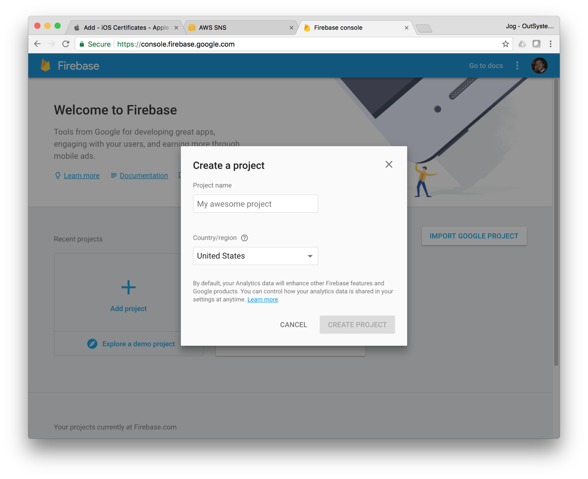
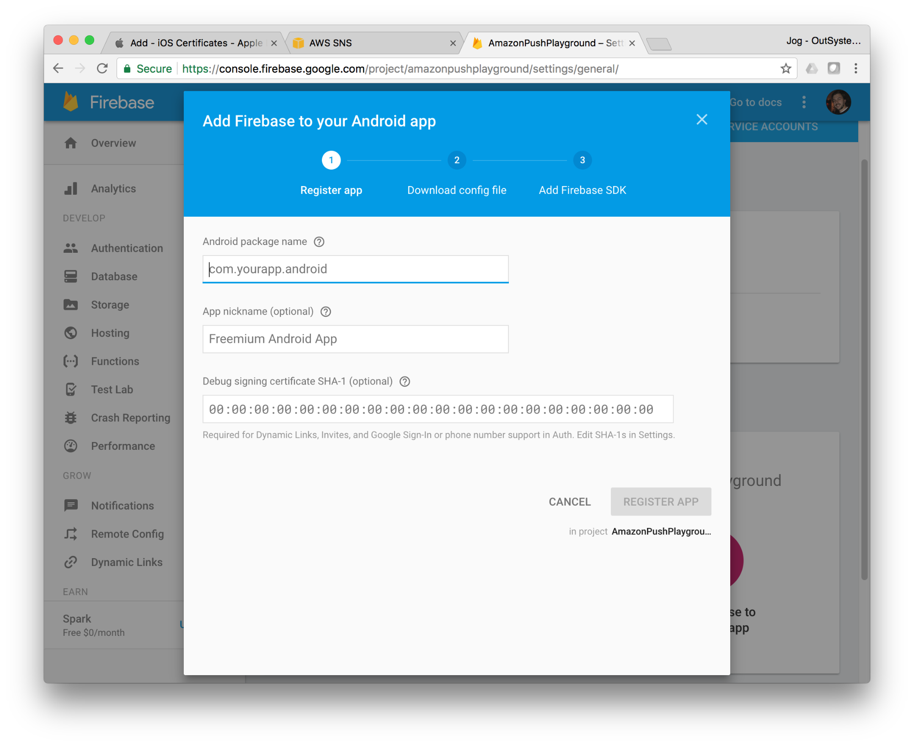

### Android Setup
* Access the [Firebase console](https://www.google.com/url?q=https://console.firebase.google.com/&sa=D&ust=1509368386700000&usg=AFQjCNF0kVIt8tVZL09uZfD0rP89M16hRQ) and create a new project.

Open Image

 

* Open project settings

Open Image

 

* And under “Your Apps” hit the “Add Firebase to your Android app” button

Open Image

 

* Set a valid Android package name for the application. This package name has to be the same as the one chosen for your OutSystems Android mobile application. 

* Hit “REGISTER APP” and save the provided “google-services.json” file. This file is used to configure the FirebaseCloudMessagePlugin in your application. See detailed information under “FirebaseCloudMessagePlugin Configurations” section.

* Under Project Settings > Cloud Messaging; copy the Server Key. 
