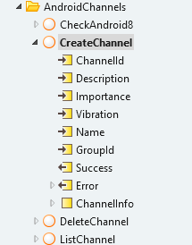
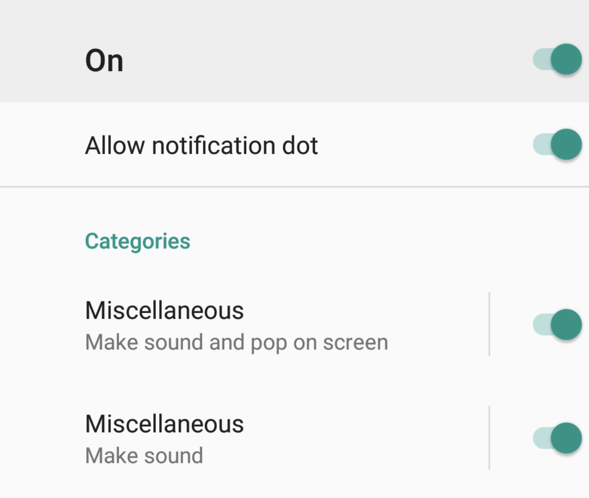
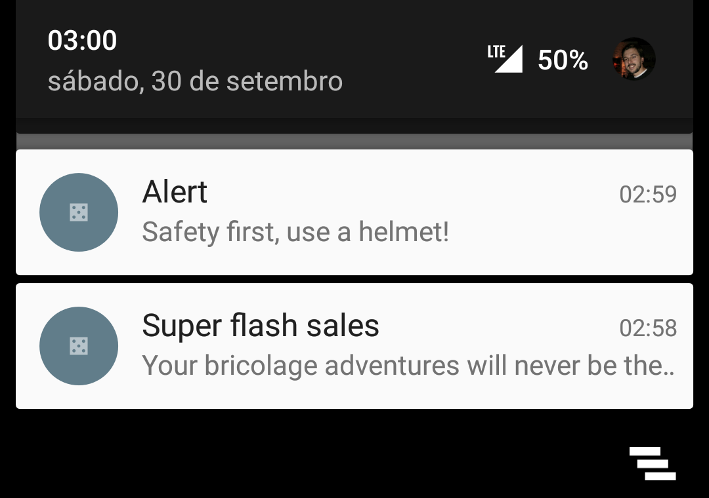
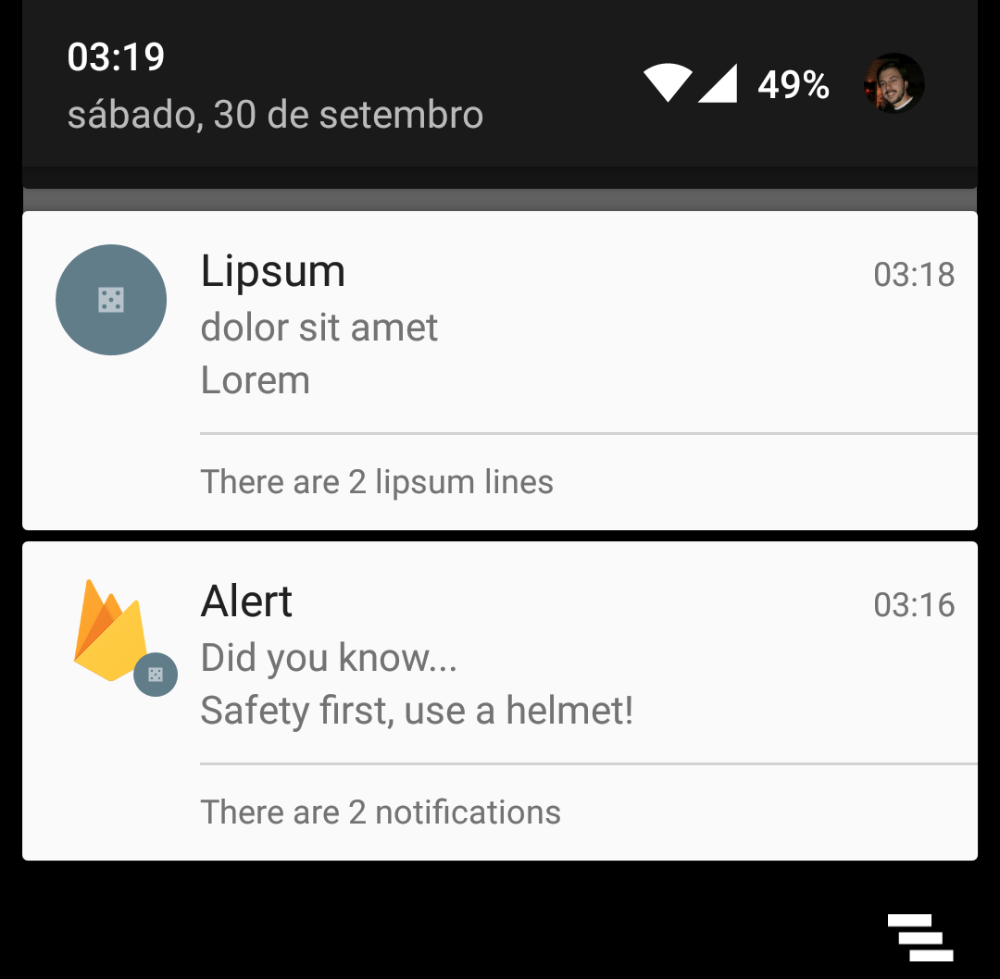
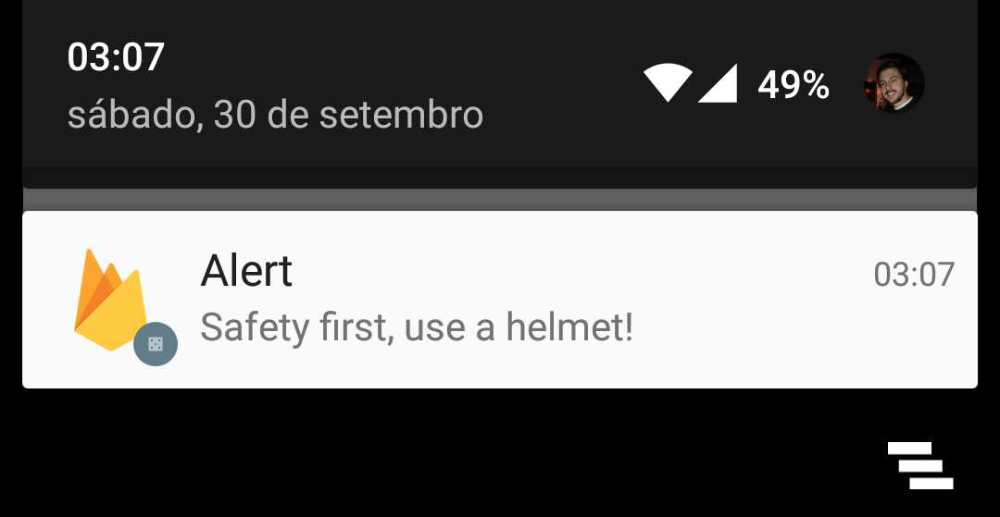
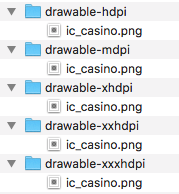
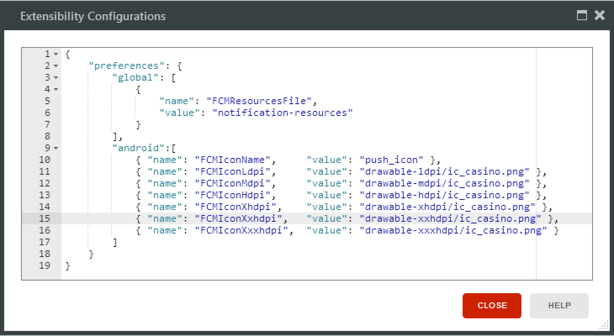

Android offers additional features such as support for rich notifications and notification stacking.

In order to leverage those features, a specific set of payloads must be used when pushing notifications to the devices.

# Channels
From Android 8.0 (API level 26) and higher, notification channels are supported and recommended.
You can create notification channels for your app using the **CreateChannel** client action. 

Client actions

 
Channels created this way can be seen in the notification properties of your application
 

Example: 

 In this example there are 2 channels created with the same name 'Miscelaneous' that have distinct behaviors. They both lie under the channel group named 'Categories' 
 

[More information ](https://firebase.google.com/docs/cloud-messaging/android/client) about android channels

# Stacking
By default, every time a notification is received on Android devices, the notification present on the notification tray will be replaced with the most recent notification. To have one different notifications on the notification tray make sure to provide a **notification id** when sending a notification. When sending a notification, provide a custom data entry with the key “**notId**” and an integer value that identifies the notification. 

Example

 

# Inbox Style Stacking 
Inbox style stacking allows to mimic the inbox style present on many messaging and email applications. To use it, add two custom data items:

1. Set key to “style” and value to “inbox”
1. Set key to “summaryText” and value to any phrase. If this phrase contains %n%, it will be replace with %n% with the number of queued notifications. 

Example: “There are %n% lipsum lines”

 

# Images
By default, notifications show the application icon as the notification image. By sending a custom data item with the key “**image**” and value set to a valid URL of an online image, the image will be shown instead of the application icon.

It is also possible to present the image in a circular fashion. For that, provide a custom data item with key “image-type” and value “circle”. 

Example

 

# Custom Icon
Android platform supports custom icons for notifications presented on the system notification center/ system tray. 

Example

 

In order to add a custom icon to your application follow these steps:

1. Create a zip file containing the icon images.
In this example, 5 images of the icon are use, each per device dimension ( See [Android Icon Design Guidelines](https://www.google.com/url?q=https://developer.android.com/guide/practices/ui_guidelines/icon_design_status_bar.html%23size11&sa=D&ust=1509368386711000&usg=AFQjCNGw2PzxvsWMDgO2QUjRNCzgGc_zSw) for detailed information). The generated zip file contains each of the following folders at the root level. 

Example

 

1. Import the zip file to your application resources and:
    1. Make sure to set “**Deploy Action**” as “**Deploy to Target Directory**”
    1. Set “**TargetDirectory**” to notification-resources. It is very important that this property value is set correctly.
1. Open “**Extensibility Configurations**” for your mobile application and set the following preferences:
    1. Global preference named FCMResourcesFile and its value set to the same name of the imported zip resource, without the extension.
    1. Android preferences:
        * **FCMIconName** - set a name for the icon. This name will be later used to initiate the plugin for Android. 
        * **FCMIconLdpi** - set the path, inside the resources zip file, to the icon for the ldpi dimension.
        * **FCMIconMdpi** - same for mdpi dimension.
        * **FCMIconHdpi** - same for hdpi dimension.
        * **FCMIconXhdpi** - same for xhdpi dimension.
        * **FCMIconXxhdpi** - same for xxhdpi dimension.
        * **FCMIconXxxhdpi** - same for xxxhdpi dimension.        
 

Example

 

1. On **InitPushNotifications**, when setting the AndroidOptions make sure to set the Icon property value the same as the value set to **FCMIconName**. In this example: “**push_icon**”
